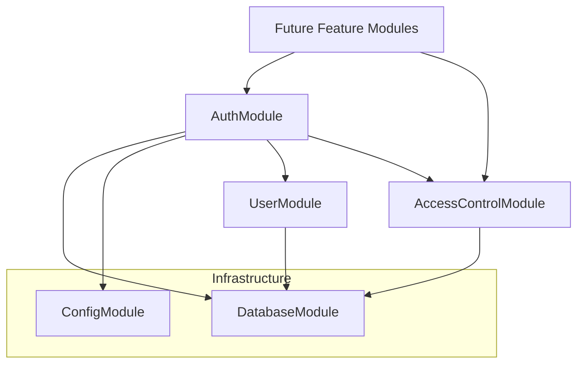

# AUTH #001 — Modular Rules & Auth/RBAC Design Audit

> Status: **COMPLETE** (design audit only — no implementation)
> Scope: Rules, module boundaries, Auth/RBAC architecture decisions
> Next prompt: **AUTH #002** (schema, entities, migrations only)

---

## 1. Objective

Define enforceable modular-architecture rules for the catechism-api backend and produce an independent Auth/RBAC design audit so subsequent AUTH prompts can implement users, login, JWT, sessions, roles, and permissions without boundary ambiguity or rework.

## 2. Scope

In scope:

- Update `PROJECT_RULES.md` with modular monolith / microservice-extraction rules.
- Add Cursor rule `.cursor/rules/03-modular-architecture.mdc`.
- Update `AGENTS.md` with a module-boundary checklist.
- Document Auth/RBAC module split, data ownership, token strategy, and security decisions.

Out of scope for this prompt (explicitly deferred):

- NestJS modules, controllers, services, guards, entities, migrations, APIs, package installs, seed data, login endpoints, JWT issuance, tests for auth behavior.

## 3. Explicit Non-Goals

- No `UserModule`, `AuthModule`, or `AccessControlModule` code.
- No database migrations or TypeORM entities for auth tables.
- No JWT, bcrypt/argon2, or `@nestjs/passport` packages.
- No changes to CI pipeline behavior beyond documentation validation gates.
- No parish/tenant scoping implementation.
- No user registration, password reset, email verification, MFA, or OAuth.

## 4. Foundation Prerequisites

| Prerequisite | Status |
|--------------|--------|
| Backend foundation (Prompt #007) | **COMPLETE** |
| Database integration / quality gates (Prompt #006) | **COMPLETE** |
| Bitbucket CI foundation (CI #004) | **COMPLETE** |
| MSSQL + TypeORM bootstrap | **COMPLETE** |
| Existing auth code | **NONE** (clean slate) |

The repository currently has infrastructure modules only (`config`, `database`, `health`, `http`, `logging`, `request-context`). No `src/modules/` business modules exist yet.

## 5. PROJECT_RULES.md Updates

Added **§7. Modular Architecture & Future Microservice Extraction** with subsections:

| Subsection | Content |
|------------|---------|
| 7.1 Module ownership | Controllers, services, entities, DTOs, guards, tests per module |
| 7.2 Cross-module boundaries | No cross-module repos/entities; public API only |
| 7.3 Shared code policy | Infrastructure-only shared code; no domain in `common/` |
| 7.4 Transactions and coupling | Document cross-module coupling; adapter pattern for integrations |
| 7.5 Dependency direction | No cycles; no default `forwardRef()` |
| 7.6 Reviews and audits | Module Boundary Audit required per business module |
| 7.7 Foreign keys across modules | SQL FKs allowed; application code respects ownership |

Renumbered former §7–§31 to §8–§32 (Definition of Done is now §31).

## 6. Cursor Rule Created

File: `.cursor/rules/03-modular-architecture.mdc` (`alwaysApply: true`)

Concise enforcement of §7: module paths, boundary prohibitions, shared-code limits, review checklist. References full rules in `PROJECT_RULES.md`.

## 7. AGENTS.md Updates

Added **Before a new business module** checklist aligned with §7.6 and a guardrail: do not implement auth/users/RBAC until an active AUTH prompt allows it.

Updated `.cursor/rules/00-mandatory-project-rules.mdc` Definition of Done reference from §30 → §31.

## 8. Current Auth/RBAC State

| Area | State |
|------|-------|
| Users table | Does not exist |
| Auth sessions | Does not exist |
| Roles / permissions | Does not exist |
| JWT / refresh flow | Not implemented |
| Guards / decorators | Not implemented |
| Auth env vars in validation | Not present |

No conflicting legacy auth code. Implementation can follow the audited design directly.

## 9. Target Module Architecture Overview

Three bounded contexts for phase-1 authentication and authorization:

| Module | Responsibility |
|--------|----------------|
| **UserModule** | User/account aggregate, account lifecycle, password hash storage |
| **AuthModule** | Login, JWT access tokens, refresh sessions, token rotation |
| **AccessControlModule** | Roles, permissions, role-permission and user-role assignments |

**Decision:** Single **AccessControlModule** for both roles and permissions (Option A). Splitting into separate Role and Permission modules adds import complexity without benefit at current scale.

## 10. Modular Monolith Rationale

- One deployable API with clear NestJS module boundaries.
- SQL foreign keys remain valid for relational integrity.
- Application code enforces ownership so tables can be split into services later.
- Auth and access-control public guards become shared infrastructure consumed by future domain modules (students, classes, etc.) without those modules querying auth tables directly.

## 11. UserModule — Purpose

Own the **user account aggregate**: identity fields, account status, and credential hash column. Provide a narrow public API for authentication lookups and password verification without exposing persistence internals.

UserModule is **not** responsible for issuing tokens, session persistence, or permission evaluation.

## 12. UserModule — Owned Data

| Table | Owner | Notes |
|-------|-------|-------|
| `users` | UserModule | Account aggregate root |

Planned columns (AUTH #002 detail):

| Column | Type | Notes |
|--------|------|-------|
| `id` | `uniqueidentifier` PK | UUID v4 |
| `email` | `nvarchar(320)` UNIQUE | Normalized login identifier |
| `password_hash` | `nvarchar(255)` | Argon2id PHC string; never plaintext |
| `status` | `varchar(32)` | `ACTIVE`, `INACTIVE`, `LOCKED` |
| `created_at` | `datetime2` | UTC |
| `updated_at` | `datetime2` | UTC |

Deferred to later AUTH hardening prompts: `last_login_at`, `failed_login_count`, `locked_at`, email verification flags, profile fields beyond minimal account needs.

## 13. UserModule — Planned Public Exports

| Export | Purpose |
|--------|---------|
| `UsersModule` | NestJS module registration |
| `UserAccountService` (name TBD) | Account lookups and password verification for AuthModule |
| `FindAccountForLoginResult` | Narrow read model: `id`, `email`, `status` — **not** `password_hash` in return type exposed to callers |
| `verifyCredentials(email, password)` | Returns success/failure + account id on success; performs hash compare internally |

AuthModule must call `verifyCredentials` (or equivalent) — it must **not** read `password_hash` via repository.

## 14. UserModule — Dependencies

| Direction | Module | Reason |
|-----------|--------|--------|
| Outbound | `DatabaseModule` | TypeORM infrastructure |
| Outbound | `ConfigModule` | If needed for account policy constants |
| Inbound | `AuthModule` | Login credential verification |
| Inbound | Future admin user-management prompts | CRUD via UserModule public API |

No dependency on AuthModule or AccessControlModule.

## 15. AuthModule — Purpose

Own **authentication workflows**: login, logout, refresh, access-token issuance, refresh-session lifecycle. Consumes UserModule for credential verification and AccessControlModule for loading effective permissions after authentication.

AuthModule must **not** become the owner of all user persistence.

## 16. AuthModule — Owned Data

| Table | Owner | Notes |
|-------|-------|-------|
| `auth_sessions` | AuthModule | Refresh token sessions |

Planned columns:

| Column | Type | Notes |
|--------|------|-------|
| `id` | `uniqueidentifier` PK | Session id |
| `user_id` | `uniqueidentifier` FK → `users.id` | SQL FK allowed (§7.7) |
| `refresh_token_hash` | `nvarchar(255)` | Hashed refresh token only |
| `token_family_id` | `uniqueidentifier` | Rotation family for reuse detection |
| `expires_at` | `datetime2` | UTC |
| `revoked_at` | `datetime2` NULL | Set on logout/revocation |
| `created_at` | `datetime2` | UTC |

**Not stored by default:** IP address, user agent (minors privacy; defer unless audit/compliance requires).

## 17. AuthModule — Planned Public Exports

| Export | Purpose |
|--------|---------|
| `AuthModule` | NestJS module |
| `JwtAuthGuard` | Validates access JWT; attaches user context |
| `CurrentUser` decorator / request type | Typed authenticated user id (+ session id if needed) |
| Auth controller routes | `/api/v1/auth/login`, `/api/v1/auth/refresh`, `/api/v1/auth/logout` (implemented in later prompts) |

Internal services (token signing, session repository) remain non-exported.

## 18. AuthModule — Dependencies

| Direction | Module | Via |
|-----------|--------|-----|
| Outbound | `UserModule` | `verifyCredentials`, account status checks |
| Outbound | `AccessControlModule` | Load roles/permissions for authorization context (post-login) |
| Outbound | `ConfigModule` | JWT secrets, expiry configuration |
| Inbound | All protected feature modules | `JwtAuthGuard`, auth decorators |

## 19. AccessControlModule — Purpose

Own **authorization data model**: roles, permissions, assignments. Provide services/guards for permission checks. Single module for roles + permissions + join tables.

## 20. AccessControlModule — Owned Data

| Table | Owner |
|-------|-------|
| `roles` | AccessControlModule |
| `permissions` | AccessControlModule |
| `user_roles` | AccessControlModule |
| `role_permissions` | AccessControlModule |

Planned shape:

**roles:** `id`, `code` (unique, e.g. `PARISH_ADMIN`), `name`, `description`, timestamps.

**permissions:** `id`, `code` (unique, `{resource}.{action}` e.g. `users.read`), `name`, `description`, timestamps.

**user_roles:** `user_id` FK, `role_id` FK, unique (`user_id`, `role_id`).

**role_permissions:** `role_id` FK, `permission_id` FK, unique (`role_id`, `permission_id`).

Roles and permissions are **data-driven** (DB rows), not hard-coded TypeScript enums for business roles.

## 21. AccessControlModule — Planned Public Exports

| Export | Purpose |
|--------|---------|
| `AccessControlModule` | NestJS module |
| `PermissionGuard` / `@RequirePermissions()` | Route-level authorization |
| `AccessControlService.getEffectivePermissions(userId)` | Permission codes for a user |
| `AccessControlService.userHasPermission(userId, code)` | Boolean check |

Other modules use guards/decorators — they do **not** query `user_roles` or `role_permissions` directly.

## 22. AccessControlModule — Dependencies

| Direction | Module | Reason |
|-----------|--------|--------|
| Outbound | `DatabaseModule` | Persistence |
| Inbound | `AuthModule` | Post-login permission loading |
| Inbound | Feature modules | Permission guards on routes |

No dependency on AuthModule for data writes. User id references use FK at SQL level only.

## 23. Module Dependency Diagram



**Rule:** No cycle. UserModule and AccessControlModule do not import AuthModule.

## 24. Cross-Module Interaction Rules

1. AuthModule calls `UserModule.verifyCredentials()` — never UserModule's repository.
2. AuthModule calls `AccessControlService.getEffectivePermissions()` after successful login — never joins auth tables from AuthModule repositories.
3. Feature modules use `JwtAuthGuard` + `PermissionGuard` — never inject `UserRepository` or role repositories.
4. Public contracts use interfaces/DTOs with user id and permission code strings — not TypeORM entities.
5. Only the owning module's migration set creates/alters its tables.

## 25. Password Storage Decision

**Decision:** Store `password_hash` on the `users` table owned by **UserModule** (Option A — single account table).

| Option | Verdict |
|--------|---------|
| A: `password_hash` on `users` | **SELECTED** — simplest for phase 1; UserModule owns all writes |
| B: Separate `user_credentials` in AuthModule | Deferred — better for SSO split later; unnecessary complexity now |

Rationale: UserModule owns the account aggregate; credential hash is part of account state. AuthModule verifies via UserModule API without owning user rows. If Auth is extracted to a microservice later, credentials can move to a dedicated table/service with a documented migration.

## 26. Login Identifier Decision

**Decision:** **Email** as the sole login identifier for phase 1.

| Rule | Detail |
|------|--------|
| Normalization | Trim whitespace; store and compare lowercase |
| Uniqueness | Unique index on normalized email |
| Username / phone login | **Deferred** |

Rationale: Parish admins, catechists, and parents typically use email; avoids duplicate identifier complexity in AUTH #002–#004.

## 27. User Status and Lifecycle

| Status | Meaning |
|--------|---------|
| `ACTIVE` | May authenticate |
| `INACTIVE` | Account disabled; login rejected |
| `LOCKED` | Temporarily blocked (failed attempts — later prompt) |

Registration flows, email verification, and self-service password reset are **deferred** to later AUTH prompts. AUTH #002 schema includes status column for guard checks at login.

## 28. Roles and Permissions Model

**Authorization path:** User → Roles (many-to-many) → Permissions (many-to-many).

**No direct user-permission grants** in phase 1. Simplifies auditing and matches parish RBAC (assign roles, roles carry permissions).

Permission codes: `{resource}.{action}` convention, lowercase, stable API for guards.

Example roles (seed in later prompt, not AUTH #002): `SUPER_ADMIN`, `PARISH_ADMIN`, `CATECHIST`, `PARENT`.

Example permissions: `users.read`, `users.manage`, `students.read`, `classes.manage`.

## 29. Join Tables and Integrity

- `user_roles`: composite unique on (`user_id`, `role_id`); FK to `users` and `roles`.
- `role_permissions`: composite unique on (`role_id`, `permission_id`); FK to `roles` and `permissions`.
- Cascading deletes: use restricted delete on FKs; soft-delete patterns deferred unless required.

Only AccessControlModule services mutate assignment tables.

## 30. Authorization Evaluation Model

At request time:

1. `JwtAuthGuard` validates JWT signature and expiry; extracts `sub` (user id).
2. `PermissionGuard` loads effective permission codes for `sub` via AccessControlModule (cache layer optional in later prompt).
3. Route declares required permission codes via decorator metadata.
4. Deny by default — missing permission → 403 with consistent error schema.

**Not used:** Client-sent role/permission claims trusted without server verification.

## 31. JWT Access Token Design

| Aspect | Decision |
|--------|----------|
| Format | JWT (HS256 symmetric for phase 1) |
| Lifetime | Short (recommended 15 minutes; env-configurable) |
| Claims | `sub` (user id), `sid` (session id, optional), `iat`, `exp` |
| Permissions in JWT | **No** full permission list — load from DB/cache on authorization |
| Role codes in JWT | **Avoid** in phase 1 — keeps token small and permissions fresh |

Rationale: Permission changes take effect without waiting for access token expiry; aligns with least privilege and minors platform safety.

## 32. Refresh Token and Session Design

| Aspect | Decision |
|--------|----------|
| Storage | `auth_sessions.refresh_token_hash` — never store raw refresh token |
| Delivery | HttpOnly Secure cookie **or** JSON body (decide in AUTH #004 implementation prompt; document cookie preference for browser clients) |
| Rotation | On refresh, issue new refresh token, invalidate previous in same `token_family_id`; detect reuse |
| Lifetime | Longer than access token (e.g. 7 days; env-configurable) |
| Revocation | Set `revoked_at`; logout revokes current session |

Hash refresh tokens with a keyed HMAC or dedicated hash (same family as password hashing policy — see §33).

## 33. Password Hashing Algorithm Decision

| Algorithm | Verdict |
|-----------|---------|
| **Argon2id** | **SELECTED** (OWASP preferred) via `argon2` npm package |
| bcrypt | Fallback if native build fails in Docker/CI |

Parameters (tune in AUTH #003 implementation): Argon2id with memory/time cost appropriate for server-side hashing on Node 22.

**AUTH #002 action:** Verify `argon2` native module builds in Docker production image and Bitbucket CI Node image before locking dependency. If build fails, document fallback to `bcrypt` (cost 12) in AUTH #002 report.

Never store plaintext passwords. Never log passwords or tokens.

## 34. Planned Environment Variables

To be added in implementation prompts (not AUTH #001):

| Variable | Purpose |
|----------|---------|
| `JWT_ACCESS_SECRET` | HS256 signing secret (required, strong) |
| `JWT_ACCESS_EXPIRES_IN` | Access token TTL (e.g. `15m`) |
| `JWT_REFRESH_EXPIRES_IN` | Refresh/session TTL (e.g. `7d`) |

Add to `env.validation.ts`, `.env.example`, and Docker docs in AUTH #004+. Fail fast if secrets missing in production.

## 35. Security Rules Alignment (PROJECT_RULES §23)

| Rule | Auth design compliance |
|------|------------------------|
| No plaintext passwords | `password_hash` only |
| Server-side authorization | PermissionGuard on all protected routes |
| No token/password logging | Session/hash storage only; redact in logs |
| Least privilege | Role-based permissions; deny default |
| Input validation | DTOs for login/refresh in later prompts |
| Rate limiting | Deferred to AUTH hardening prompt; noted for login endpoint |

## 36. Privacy / Minors Alignment (PROJECT_RULES §24)

- Auth sessions do not store IP/user agent by default.
- JWT carries minimal claims (user id only).
- No public user profile from auth endpoints in phase 1.
- Parent/child relationship authorization is a **future domain module** concern, not AuthModule.
- Do not expose other users' emails or roles via generic auth APIs.

## 37. Folder Structure

```
src/modules/
  users/
    users.module.ts
    controllers/          # later admin prompts
    services/
    entities/
    dto/
    interfaces/           # public read models / contracts
  auth/
    auth.module.ts
    controllers/
    services/
    entities/
    dto/
    guards/
    strategies/           # if passport used
  access-control/
    access-control.module.ts
    services/
    entities/
    dto/
    guards/
    decorators/
```

Infrastructure remains outside `src/modules/` (`config`, `database`, `health`, etc.).

## 38. Future Microservice Extraction Map

| Future service | Tables / capabilities | Extraction notes |
|----------------|----------------------|------------------|
| Identity / User service | `users` | Move password hash with user; Auth calls HTTP/gRPC verify |
| Auth service | `auth_sessions`, token issuance | Already isolated in AuthModule |
| Policy / RBAC service | `roles`, `permissions`, joins | AccessControlModule maps cleanly |

Cross-service: replace SQL FKs with eventual consistency + id validation at API boundaries. Public module APIs become client interfaces.

## 39. Deferred Concerns

| Concern | Target |
|---------|--------|
| Parish / tenant scope on roles | Future authorization-scope design (`parish_id` on assignments) |
| OAuth / SSO | Post password-auth MVP |
| MFA | Hardening phase |
| Email verification / password reset | Dedicated AUTH prompts |
| Account lockout / rate limiting | AUTH hardening |
| Permission caching (Redis) | Performance phase |
| Audit log for admin role changes | Admin module |
| Child login accounts | Domain + privacy review |

## 40. Risks and Open Questions

| ID | Risk | Mitigation |
|----|------|------------|
| R-001 | `argon2` native module CI/Docker build | Verify in AUTH #002; bcrypt fallback documented |
| R-002 | Permission load on every request | Accept for MVP; cache in later prompt |
| R-003 | Refresh token transport (cookie vs body) | Decide in AUTH #004 with frontend alignment |
| R-004 | Email uniqueness across parishes | Global unique email for phase 1; revisit with tenant model |
| R-005 | JWT secret rotation | Document manual rotation procedure in AUTH #004 |

No blockers for AUTH #002 schema work.

## 41. AUTH #002 Readiness Checklist

| Item | Ready |
|------|-------|
| Module boundaries defined | Yes |
| Table ownership assigned | Yes |
| FK strategy documented | Yes |
| Password column location decided | Yes |
| Role/permission model decided | Yes |
| No conflicting legacy auth code | Yes |
| PROJECT_RULES §7 in place | Yes |

**AUTH #002 may proceed** with: TypeORM entities, migrations for `users`, `roles`, `permissions`, `user_roles`, `role_permissions`, `auth_sessions` — no controllers or login APIs.

## 42. Validation and Completion

### Files changed (AUTH #001)

| File | Change |
|------|--------|
| `PROJECT_RULES.md` | Added §7; renumbered §8–§32 |
| `.cursor/rules/03-modular-architecture.mdc` | Created |
| `.cursor/rules/00-mandatory-project-rules.mdc` | §31 reference |
| `.cursor/rules/02-engineering-baseline.mdc` | Module boundary note |
| `AGENTS.md` | Module boundary checklist |
| `docs/AUTH_001_MODULAR_RULES_AND_AUTH_RBAC_AUDIT_REPORT.md` | This report |

### Validation commands

```bash
npm run format:check && npm run lint && npm run typecheck && npm test && npm run test:e2e && npm run build
```

Results:

| Gate | Result |
|------|--------|
| `npm run format:check` | **PASS** |
| `npm run lint` | **PASS** |
| `npm run typecheck` | **PASS** |
| `npm test` | **PASS** (12 suites, 45 tests) |
| `npm run test:e2e` | **PASS** (2 suites, 5 tests) |
| `npm run build` | **PASS** |

### Suggested commit message

```
docs: define modular architecture rules and auth RBAC audit
```

### Completion statement

**AUTH #001 COMPLETE.** Modular architecture rules are committed to `PROJECT_RULES.md` and Cursor rules. Auth/RBAC design is audited and ready for **AUTH #002** (schema + entities + migrations only). No auth implementation was performed in this prompt.
