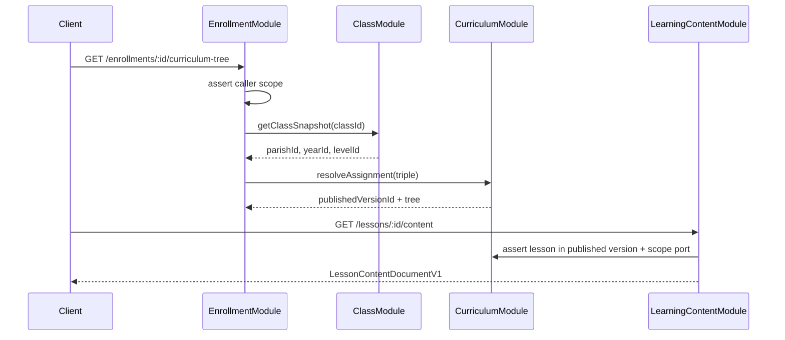

# CURRICULUM #001 — Domain Audit + Content Model Design

> Status: **COMPLETE** (design/audit only — no implementation)
> Phase: **#001/6**
> Scope: Curriculum, Topic, Lesson, Learning Content — module split, versioning, content model, scoped read direction, API planning
> Next prompt: **CURRICULUM #002** — Schema + Entities + Migrations (when prompted)

---

## 1. Objective

Perform a deep domain audit and bounded-context design for the Curriculum + Topic + Lesson + Learning Content phase:

- Separate **curriculum identity** (parish + catechism level) from **academic-year delivery** (assignments)
- Design **versioned, publishable** curriculum trees (topics → lessons) with immutable published snapshots
- Choose a **structured learning content model** (JSON blocks v1) suitable for FE/Mobile rendering without raw HTML
- Define **module split**, ownership, dependency graph, and public contracts without coupling to Class schema changes
- Plan **parish-scoped manage** and **enrollment/class-scoped read** for published content only
- Plan conceptual APIs and FE-safe DTO direction

**No schema, entities, migrations, services, controllers, seeds, or APIs were implemented.**

---

## 2. State Inherited From Previous Phases

| Area | State |
|------|-------|
| Backend Foundation | **COMPLETE** |
| Bitbucket CI | **COMPLETE** |
| Auth / User / RBAC | **COMPLETE** (AUTH #001–#009) |
| Parish / Academic Year / Catechism Level | **COMPLETE** (PARISH #001–#005) |
| Class / Student / Catechist / Parent / Enrollment | **COMPLETE** (CLASS #001–#007A) |
| Modules (existing) | `UsersModule`, `AuthModule`, `AccessControlModule`, `ParishModule`, `AcademicStructureModule`, `StudentModule`, `ClassModule`, `EnrollmentModule`, `ClassDomainScopeModule` |
| Class entity | `(parishId, academicYearId, catechismLevelId)` — operational cohort anchor |
| Enrollment scope | `EnrollmentAccessService`, guardian/class read ports — acyclic graph, 0 `forwardRef` in class domain |
| RBAC | Global permissions; class placeholders `classes.read` / `classes.manage` hardened with scoped services |
| Demo seed chain | `seed:auth-rbac` → `seed:parish-academic` → `seed:class-enrollment` |
| Curriculum code | **None** — greenfield |
| Working tree | Uncommitted CLASS #005–#007A work; pre-existing CRLF format/lint drift on 6 test/scope files |

---

## 3. Rules Applied

Read and applied:

- `PROJECT_RULES.md` — §7 modular architecture, §22–§23 security/privacy (minors), §31 Definition of Done
- `AGENTS.md`
- `.cursor/rules/*.mdc`
- `docs/CLASS_007A_FINAL_ARCHITECTURE_AND_CONTRACT_AUDIT_REPORT.md`
- `docs/CLASS_001_DOMAIN_AUDIT_AND_BOUNDARY_DESIGN_REPORT.md`
- `docs/PARISH_005_FINAL_INTEGRATION_HARDENING_REPORT.md`

Key constraints applied:

1. Modular monolith; scalar IDs across module boundaries; no cross-module entity/repository imports
2. SQL FKs allowed in migrations; application ownership remains isolated
3. UUID v4 PKs (application-generated)
4. English naming; `nvarchar` for human-readable text
5. No `parish_id` on `users`
6. Published curriculum snapshots are **immutable**; edits require new DRAFT version
7. Minors: read paths expose **published** content only; no public child-facing curriculum browsing
8. Do not store pastoral/confessional data in lesson content fields
9. No file upload / media storage module in this phase — scalar media IDs only

**No new rules or `.mdc` files required.**

---

## 4. Domain Definitions

### Curriculum

A **parish-owned instructional program** for one **catechism level** (e.g. "Khai Tâm — Parish Demo"). Defines the long-lived identity and versioning lineage. Does **not** embed `academicYearId` — year binding is a separate assignment concern.

### Curriculum Version

A **point-in-time snapshot** of a curriculum's structure and metadata with lifecycle `DRAFT` | `PUBLISHED` | `ARCHIVED`. Published versions are frozen; structural edits happen only on DRAFT copies.

### Curriculum Assignment

Binds a **published curriculum version** to `(parishId, academicYearId, catechismLevelId)` for delivery in a given year. Resolves which published tree classes/enrollments consume without altering `classes` schema in MVP.

### Topic

An **ordered grouping unit** within one curriculum version (e.g. "Phép Rửa Tội", "Bí tích Thánh Thể"). Topics belong to a version, not to the curriculum root directly.

### Lesson

An **ordered teachable unit** within a topic. Carries display metadata (title, summary, duration estimate) and links to learning content. Includes a **stable canonical key** across version clones for future progress tracking.

### Learning Content

The **structured document body** for a lesson row in a specific version — JSON block array v1, schema-versioned, validated server-side. Distinct from lesson metadata for separation of concerns and future content tooling.

---

## 5. Curriculum vs Academic Year Decision

| Option | Verdict |
|--------|---------|
| A. `academic_year_id` on `curriculums` root | **Rejected** — duplicates curriculum per year; hard to reuse across years |
| B. Curriculum per level only; year via assignment | **Selected** |
| C. Curriculum per class | **Rejected** — couples content to operational cohort; wrong boundary |

### Final decision

```
curriculums           = parish_id + catechism_level_id + code (long-lived identity)
curriculum_versions   = versioned snapshots (DRAFT/PUBLISHED/ARCHIVED)
curriculum_assignments = parish + academic_year + catechism_level → published_version_id
```

**Rationale:** A parish reuses the same level curriculum across years with minor yearly tweaks via new published versions. Classes already carry `(parishId, academicYearId, catechismLevelId)` — assignment table is the join surface for "which published tree applies this year".

---

## 6. Versioning Model Decision

| Option | Verdict |
|--------|---------|
| A. Mutable rows with `is_published` flag | **Rejected** — breaks immutability and audit |
| B. Separate `curriculum_versions` + version-scoped tree | **Selected** |
| C. Event-sourced full history | **Rejected** — complexity ceiling for MVP |

### Lifecycle

| Status | Meaning | Mutability |
|--------|---------|------------|
| `DRAFT` | Work in progress | Structure + content editable |
| `PUBLISHED` | Live snapshot | **Immutable** — no PATCH to topics/lessons/content |
| `ARCHIVED` | Superseded published | Read-only historical reference |

### Rules

1. At most **one DRAFT** per curriculum at a time (application enforced)
2. Publish transitions DRAFT → PUBLISHED atomically; sets `published_at`, `published_by_user_id`
3. New edits after publish: **clone** published version → new DRAFT (deep copy topics, lessons, content)
4. Prior PUBLISHED may become ARCHIVED when a newer version is assigned (assignment update policy in #004)
5. Version numbers monotonic integer per curriculum (`1`, `2`, `3`, …)

---

## 7. Lesson Identity Decision (Progress Linkage)

| Option | Verdict |
|--------|---------|
| A. Lesson rows only; progress references version-scoped lesson `id` | **Rejected** — breaks when new version published |
| B. Stable `lesson_roots` + `lesson_versions` tables | Valid but heavier |
| C. `canonical_lesson_key` UUID on version-scoped lesson rows, copied on clone | **Selected for MVP** |

### Final decision

Each `lessons` row includes `canonical_lesson_key` (UUID v4, assigned on first creation). When cloning a version, copy rows preserve the same `canonical_lesson_key` where semantic identity matches (automated 1:1 mapping during clone).

Future **ProgressModule** references `(curriculumId, canonicalLessonKey)` or `(enrollmentId, canonicalLessonKey)` — not version-scoped lesson PK.

**Tradeoff accepted:** Renumbering/reordering uses version-scoped `sort_order`; deleting a lesson in a new draft without clone mapping is a product decision handled in #004 (prefer END/hide flag over delete).

---

## 8. Topic / Lesson Hierarchy Decision

**Selected: strict two-level tree under curriculum version**

```
curriculum_version
  └── topics (ordered)
        └── lessons (ordered)
              └── lesson_content (0..1 per lesson row in MVP)
```

| Rejected | Reason |
|----------|--------|
| Nested topics (topic → subtopic) | YAGNI — add `parent_topic_id` later if product requires |
| Lessons without topics | Flat list harder for FE navigation; topic provides curriculum UX grouping |
| Cross-version shared topic rows | Violates published immutability |

**MVP cardinality:** One `lesson_contents` row per lesson row (1:1). Splitting draft/published content state is unnecessary because immutability is at version level.

---

## 9. Learning Content Model Decision

| Option | Verdict |
|--------|---------|
| A. Raw HTML in `nvarchar(max)` | **Rejected** — XSS/rendering inconsistency; poor mobile parity |
| B. Markdown string | **Deferred** — still rendering-variant across clients |
| C. JSON block document v1 | **Selected** |
| D. External CMS URL only | **Rejected** — no offline/minor-appropriate control |

### Block document v1 (design)

```typescript
interface LessonContentDocumentV1 {
  readonly schemaVersion: 1;
  readonly blocks: LessonContentBlockV1[];
}

type LessonContentBlockV1 =
  | { type: 'heading'; level: 1 | 2 | 3; text: string }
  | { type: 'paragraph'; text: string }
  | { type: 'bullet_list'; items: string[] }
  | { type: 'numbered_list'; items: string[] }
  | { type: 'scripture_ref'; citation: string; text?: string }
  | { type: 'callout'; variant: 'info' | 'tip' | 'important'; text: string }
  | { type: 'image_ref'; assetId: string; alt: string }
  | { type: 'video_ref'; assetId: string; title?: string };
```

- Stored as validated JSON in `content_json` (`nvarchar(max)`)
- `content_schema_version` column = `1` initially
- Text fields: plain UTF-8 strings; no embedded HTML
- Media blocks reference **scalar `assetId`** only — MediaModule/file upload out of scope (#001–#004)

---

## 10. Publishing Workflow Decision

### Commands (service layer #004)

| Command | Owner | Preconditions |
|---------|-------|---------------|
| `createCurriculum` | CurriculumModule | Parish admin scope; unique code per `(parishId, catechismLevelId)` |
| `createDraftVersion` | CurriculumModule | No existing DRAFT; source = latest PUBLISHED or empty v1 |
| `updateDraftStructure` | CurriculumModule | Version status = DRAFT |
| `updateLessonContent` | LearningContentModule | Parent lesson belongs to DRAFT version |
| `publishVersion` | CurriculumModule | Version = DRAFT; validation passes (≥1 topic, ≥1 lesson, content completeness policy TBD in #004) |
| `assignPublishedVersion` | CurriculumModule | Target version = PUBLISHED; unique assignment per `(parish, year, level)` |

### Immutability enforcement

- Repository/service guards reject writes when `curriculum_version.status !== 'DRAFT'`
- DB optional: triggers deferred; application layer primary for MVP

---

## 11. Class Integration Decision (Future-Safe, No Schema Change Now)

| Option | Verdict |
|--------|---------|
| A. `curriculum_assignment_id` FK on `classes` | **Deferred** — not required for MVP delivery |
| B. Resolve via `(parishId, academicYearId, catechismLevelId)` lookup | **Selected** |
| C. Duplicate curriculum tree per class | **Rejected** |

### Resolution flow (design #005)

```
Class (parishId, academicYearId, catechismLevelId)
  → CurriculumAssignment lookup
  → published curriculumVersionId
  → tree + lesson content (published only)
```

Enrollment/class scope services (existing) gate **read** access; CurriculumModule does not import EnrollmentModule.

---

## 12. User Identity vs Curriculum Author Decision

| Actor | Identity | Curriculum role |
|-------|----------|-----------------|
| Parish admin | User + `parish_memberships` | Create/edit/publish/assign |
| Catechist | User + class assignment | Read published for assigned class context |
| Parent | User + guardian link | Read published for enrolled child's class context |
| Student | Optional User + enrollment | Read published for own enrollment context |
| Super admin | Global role | Cross-parish read/manage (policy #005) |

**No separate AuthorProfile table.** Audit columns: `created_by_user_id`, `published_by_user_id`, standard `created_at`/`updated_at`.

---

## 13. Curriculum Root Model

### Required fields (schema #002)

| Field | Purpose |
|-------|---------|
| `id` | UUID PK |
| `parish_id` | Organizational scope |
| `catechism_level_id` | Level scope (FK → catechism_levels) |
| `code` | Stable machine id within parish+level |
| `name` | Display title |
| `description` | Optional short admin description |
| `status` | `ACTIVE` \| `INACTIVE` (catalog lifecycle) |
| `current_published_version_id` | Nullable denormalized pointer for admin UI |
| `created_at`, `updated_at` | Audit |

### Deferred fields

| Field | Reason |
|-------|--------|
| `locale` / i18n columns | Single-locale MVP; i18n phase later |
| `thumbnail_asset_id` | Media module not ready |
| Tags / taxonomy | Product undefined |

---

## 14. Module Split Decision

### Selected: **CurriculumModule + LearningContentModule**

| Option | Verdict |
|--------|---------|
| A. Single CurriculumModule owns everything | Acceptable but mixes tree CRUD with JSON document validation |
| B. CurriculumModule + LearningContentModule | **Selected** — clear extraction boundary |
| C. TopicModule + LessonModule separately | **Rejected** — over-fragmentation for cohesive tree |

### Justification

1. **CurriculumModule** owns structure, versioning, assignments, publish workflow
2. **LearningContentModule** owns block document validation, content read/write ports
3. Learning content depends on curriculum lesson IDs — one-way dependency
4. Future microservice split: Curriculum Service + Content Service (or merged later if small)
5. Avoids Class/Enrollment import cycles — integration via IDs and #005 scope orchestration

---

## 15. Data Ownership Matrix

| Concept / Table | Owner Module | Allowed Writer | Public Readers (contracts) | Future Service |
|-----------------|--------------|----------------|------------------------------|----------------|
| `curriculums` | CurriculumModule | CurriculumModule | LearningContentModule (validate lesson) | Curriculum Service |
| `curriculum_versions` | CurriculumModule | CurriculumModule | LearningContentModule, scope services | Curriculum Service |
| `topics` | CurriculumModule | CurriculumModule | LearningContentModule | Curriculum Service |
| `lessons` | CurriculumModule | CurriculumModule | LearningContentModule | Curriculum Service |
| `curriculum_assignments` | CurriculumModule | CurriculumModule | Class/Enrollment orchestration (#005) | Curriculum Service |
| `lesson_contents` | LearningContentModule | LearningContentModule | CurriculumModule (via content port) | Content Service |
| `parishes`, `catechism_levels`, `academic_years` | Parish / AcademicStructure | Respective owners | CurriculumModule (validate IDs) | Existing services |
| `classes`, `enrollments` | Class / Enrollment | Respective owners | Scope services only | Existing services |

---

## 16. Dependency Graph

```
UsersModule                         (no domain dependency)
AccessControlModule
AuthModule                          → UsersModule

ParishModule
AcademicStructureModule             → ParishModule

CurriculumModule                    → ParishModule
                                    → AcademicStructureModule

LearningContentModule               → CurriculumModule (lesson validation port only)

StudentModule                       → UsersModule
ClassModule                         → ParishModule, AcademicStructureModule
EnrollmentModule                    → StudentModule, ClassModule
ClassDomainScopeModule (@Global)    → EnrollmentModule (ports)

AppModule                           → all modules above
```

- **Acyclic** — CurriculumModule does **not** import ClassModule or EnrollmentModule
- LearningContentModule does **not** import EnrollmentModule
- Cross-domain read scope wired in **#005** via scope ports (mirror ClassDomainScope pattern), not direct module imports

---

## 17. Public Contract Plan

All cross-module contracts are **narrow snapshots** — never entities.

### CurriculumSnapshot

```typescript
interface CurriculumSnapshot {
  readonly id: string;
  readonly parishId: string;
  readonly catechismLevelId: string;
  readonly code: string;
  readonly name: string;
  readonly status: CurriculumStatus;
  readonly currentPublishedVersionId: string | null;
}
```

### CurriculumVersionSnapshot

```typescript
interface CurriculumVersionSnapshot {
  readonly id: string;
  readonly curriculumId: string;
  readonly versionNumber: number;
  readonly status: CurriculumVersionStatus;
  readonly publishedAt: Date | null;
  readonly publishedByUserId: string | null;
}
```

### CurriculumAssignmentSnapshot

```typescript
interface CurriculumAssignmentSnapshot {
  readonly id: string;
  readonly parishId: string;
  readonly academicYearId: string;
  readonly catechismLevelId: string;
  readonly curriculumVersionId: string;
  readonly assignedAt: Date;
}
```

### TopicSnapshot / LessonSnapshot

```typescript
interface TopicSnapshot {
  readonly id: string;
  readonly curriculumVersionId: string;
  readonly code: string | null;
  readonly title: string;
  readonly description: string | null;
  readonly sortOrder: number;
}

interface LessonSnapshot {
  readonly id: string;
  readonly curriculumVersionId: string;
  readonly topicId: string;
  readonly canonicalLessonKey: string;
  readonly code: string | null;
  readonly title: string;
  readonly summary: string | null;
  readonly sortOrder: number;
  readonly estimatedDurationMinutes: number | null;
}
```

### LessonContentSnapshot (LearningContentModule export)

```typescript
interface LessonContentSnapshot {
  readonly id: string;
  readonly lessonId: string;
  readonly contentSchemaVersion: number;
  readonly contentJson: LessonContentDocumentV1;
  readonly updatedAt: Date;
}
```

### Planned validation methods

| Method | Owner |
|--------|-------|
| `getCurriculumById(id)` | CurriculumModule |
| `assertCurriculumBelongsToParish(curriculumId, parishId)` | CurriculumModule |
| `getPublishedVersionForAssignment(parishId, yearId, levelId)` | CurriculumModule |
| `getVersionTree(versionId)` | CurriculumModule |
| `assertLessonInDraftVersion(lessonId)` | CurriculumModule |
| `getLessonContent(lessonId)` | LearningContentModule |
| `upsertLessonContent(lessonId, document)` | LearningContentModule |

---

## 18. Curriculum Schema Plan

### Table: `curriculums`

| Column | Type | Required | Notes |
|--------|------|----------|-------|
| `id` | `uniqueidentifier` | PK | UUID v4 |
| `parish_id` | `uniqueidentifier` | FK → `parishes.id` | RESTRICT |
| `catechism_level_id` | `uniqueidentifier` | FK → `catechism_levels.id` | RESTRICT |
| `code` | `varchar(32)` | Yes | Normalized lowercase |
| `name` | `nvarchar(128)` | Yes | Display |
| `description` | `nvarchar(512)` | Nullable | Admin only |
| `status` | `varchar(32)` | Yes | ACTIVE \| INACTIVE |
| `current_published_version_id` | `uniqueidentifier` | Nullable | FK → curriculum_versions.id |
| `created_at` | `datetime2` | Yes | UTC |
| `updated_at` | `datetime2` | Yes | UTC |

---

## 19. Curriculum Version Schema Plan

### Table: `curriculum_versions`

| Column | Type | Required | Notes |
|--------|------|----------|-------|
| `id` | `uniqueidentifier` | PK | UUID v4 |
| `curriculum_id` | `uniqueidentifier` | FK → `curriculums.id` | RESTRICT |
| `version_number` | `int` | Yes | Monotonic per curriculum |
| `status` | `varchar(32)` | Yes | DRAFT \| PUBLISHED \| ARCHIVED |
| `label` | `nvarchar(128)` | Nullable | e.g. "2026 refresh" |
| `published_at` | `datetime2` | Nullable | Set on publish |
| `published_by_user_id` | `uniqueidentifier` | Nullable | FK → users.id |
| `created_by_user_id` | `uniqueidentifier` | Nullable | FK → users.id |
| `created_at` | `datetime2` | Yes | UTC |
| `updated_at` | `datetime2` | Yes | UTC |

---

## 20. Topic Schema Plan

### Table: `topics`

| Column | Type | Required | Notes |
|--------|------|----------|-------|
| `id` | `uniqueidentifier` | PK | UUID v4 |
| `curriculum_version_id` | `uniqueidentifier` | FK | RESTRICT |
| `code` | `varchar(32)` | Nullable | Optional stable code within version |
| `title` | `nvarchar(256)` | Yes | Display |
| `description` | `nvarchar(1024)` | Nullable | |
| `sort_order` | `int` | Yes | 0-based or 1-based — pick 0-based in #002 |
| `created_at` | `datetime2` | Yes | UTC |
| `updated_at` | `datetime2` | Yes | UTC |

---

## 21. Lesson Schema Plan

### Table: `lessons`

| Column | Type | Required | Notes |
|--------|------|----------|-------|
| `id` | `uniqueidentifier` | PK | UUID v4 — version-scoped row id |
| `curriculum_version_id` | `uniqueidentifier` | FK | Denormalized for query efficiency |
| `topic_id` | `uniqueidentifier` | FK → topics.id | RESTRICT |
| `canonical_lesson_key` | `uniqueidentifier` | Yes | Stable across version clones |
| `code` | `varchar(32)` | Nullable | Optional |
| `title` | `nvarchar(256)` | Yes | |
| `summary` | `nvarchar(1024)` | Nullable | |
| `sort_order` | `int` | Yes | Order within topic |
| `estimated_duration_minutes` | `int` | Nullable | |
| `created_at` | `datetime2` | Yes | UTC |
| `updated_at` | `datetime2` | Yes | UTC |

---

## 22. Learning Content Schema Plan

### Table: `lesson_contents`

| Column | Type | Required | Notes |
|--------|------|----------|-------|
| `id` | `uniqueidentifier` | PK | UUID v4 |
| `lesson_id` | `uniqueidentifier` | FK → lessons.id | RESTRICT; unique |
| `content_schema_version` | `int` | Yes | Start at `1` |
| `content_json` | `nvarchar(max)` | Yes | Validated JSON document |
| `created_at` | `datetime2` | Yes | UTC |
| `updated_at` | `datetime2` | Yes | UTC |

**Ownership:** LearningContentModule entity; `lesson_id` validated via CurriculumModule public port before write.

---

## 23. Curriculum Assignment Schema Plan

### Table: `curriculum_assignments`

| Column | Type | Required | Notes |
|--------|------|----------|-------|
| `id` | `uniqueidentifier` | PK | UUID v4 |
| `parish_id` | `uniqueidentifier` | FK | RESTRICT |
| `academic_year_id` | `uniqueidentifier` | FK | RESTRICT |
| `catechism_level_id` | `uniqueidentifier` | FK | RESTRICT |
| `curriculum_version_id` | `uniqueidentifier` | FK → curriculum_versions.id | Must be PUBLISHED |
| `assigned_by_user_id` | `uniqueidentifier` | Nullable | FK → users.id |
| `assigned_at` | `datetime2` | Yes | UTC |
| `created_at` | `datetime2` | Yes | UTC |
| `updated_at` | `datetime2` | Yes | UTC |

**Unique:** one row per `(parish_id, academic_year_id, catechism_level_id)`.

---

## 24. Status Enums / Lifecycles

### CurriculumStatus (root catalog)

| Status | Meaning |
|--------|---------|
| `ACTIVE` | Visible to admins; may have versions |
| `INACTIVE` | Retired from new assignments; historical data preserved |

### CurriculumVersionStatus

| Status | Meaning | Transitions |
|--------|---------|-------------|
| `DRAFT` | Editable | → PUBLISHED |
| `PUBLISHED` | Immutable live snapshot | → ARCHIVED (when superseded) |
| `ARCHIVED` | Historical published | Terminal |

### Assignment policy

- Replacing assignment for same triple **updates** row to new `curriculum_version_id` (with audit) — does not delete history of versions themselves

---

## 25. Uniqueness Constraints

| Constraint | Table | Rule |
|------------|-------|------|
| `UQ_curriculums_parish_id_catechism_level_id_code` | `curriculums` | Code unique per parish+level |
| `UQ_curriculum_versions_curriculum_id_version_number` | `curriculum_versions` | Version number unique per curriculum |
| `UQ_curriculum_versions_curriculum_id_draft` (filtered) | `curriculum_versions` | One DRAFT per curriculum |
| `UQ_topics_version_id_sort_order` | `topics` | Unique sort order per version (optional — or enforce in service only) |
| `UQ_lessons_topic_id_sort_order` | `lessons` | Unique sort order per topic |
| `UQ_lesson_contents_lesson_id` | `lesson_contents` | One content doc per lesson row |
| `UQ_curriculum_assignments_parish_year_level` | `curriculum_assignments` | One assignment per triple |

---

## 26. Index Strategy

| Index | Purpose |
|-------|---------|
| `IX_curriculums_parish_id_catechism_level_id` | Admin list by parish+level |
| `IX_curriculum_versions_curriculum_id_status` | Find DRAFT / latest PUBLISHED |
| `IX_topics_curriculum_version_id_sort_order` | Tree load |
| `IX_lessons_topic_id_sort_order` | Tree load |
| `IX_lessons_canonical_lesson_key` | Future progress lookups |
| `IX_curriculum_assignments_parish_year_level` | Class delivery resolution |
| `IX_lesson_contents_lesson_id` | Content fetch |

---

## 27. Cross-Module FK Strategy

### SQL (migration — allowed)

```
curriculums.parish_id                    → parishes.id
curriculums.catechism_level_id           → catechism_levels.id
curriculums.current_published_version_id → curriculum_versions.id (nullable)
curriculum_versions.curriculum_id        → curriculums.id
curriculum_versions.published_by_user_id → users.id (nullable)
topics.curriculum_version_id             → curriculum_versions.id
lessons.topic_id                         → topics.id
lessons.curriculum_version_id            → curriculum_versions.id
lesson_contents.lesson_id                → lessons.id
curriculum_assignments                   → parishes, academic_years, catechism_levels, curriculum_versions
```

All `ON DELETE RESTRICT`. No FK from `classes` to curriculum tables in MVP.

### Application layer

- CurriculumModule validates parish/level/year IDs via ParishModule and AcademicStructureModule public APIs
- LearningContentModule validates `lessonId` via CurriculumModule port; never imports lesson entity repository

---

## 28. Cross-Module ORM Rules

Same as Class/Parish phases:

1. Entities private to owning module
2. Repositories not exported
3. `TypeOrmModule.forFeature` only in owning module
4. Extend `module-boundaries.spec.ts` in #002/#003
5. Metadata integration tests for new entities in `src/database/`

---

## 29. RBAC Permission Namespace Plan

### New permissions (#003 seed)

| Permission | Purpose |
|------------|---------|
| `curricula.read` | Read curriculum metadata and published trees (scoped) |
| `curricula.manage` | CRUD draft structure, assignments (scoped) |
| `curricula.publish` | Publish draft versions (scoped; may combine with manage initially) |
| `lesson-content.read` | Read lesson JSON content (scoped) |
| `lesson-content.manage` | Edit content on DRAFT lessons (scoped) |

### Role mapping (initial)

| Role | Permissions |
|------|-------------|
| SUPER_ADMIN | All |
| PARISH_ADMIN | `curricula.*`, `lesson-content.*` within parish membership |
| CATECHIST | `curricula.read`, `lesson-content.read` — **plus scope evidence** |
| PARENT | `curricula.read`, `lesson-content.read` — **plus scope evidence** |
| STUDENT | `curricula.read`, `lesson-content.read` — **plus scope evidence** |

**Permanent invariant:** Permission alone never grants access. Published-only filter + enrollment/class/guardian scope required for non-admin reads.

---

## 30. Scoped Authorization Strategy

**Decision: global permissions + curriculum scope service (#005)**

Mirror CLASS #006 pattern:

1. `@RequirePermissions('curricula.manage')` for capability
2. `CurriculumAccessService` (or extend enrollment scope orchestrator) asserts:
   - **Manage/publish:** ACTIVE `parish_memberships` for `curriculum.parishId`
   - **Catechist read:** ACTIVE assignment to a class whose triple matches an assignment row; target version = assigned published version
   - **Parent/student read:** ACTIVE enrollment in class whose triple resolves to assignment; student sees only published tree

### Read path rules

| Caller | May read DRAFT? | May read PUBLISHED? |
|--------|-----------------|---------------------|
| Parish admin (member) | Yes (own parish) | Yes |
| Catechist | No | Yes (assigned class context) |
| Parent | No | Yes (child enrollment context) |
| Student | No | Yes (own enrollment context) |

No public anonymous curriculum endpoints.

---

## 31. Security / Privacy Matrix (Minors)

| Risk | Mitigation |
|------|------------|
| Draft content leaked to students | API filters by version status; integration tests in #005 |
| Cross-parish curriculum read | All queries filter by resolved parish from scope evidence |
| HTML/script injection | Block model rejects HTML; validate block shapes; max JSON size cap |
| Oversized content payloads | Limit `content_json` size (e.g. 256 KB MVP) and block count |
| Spiritual profiling | Content is instructional only; no analytics on faith quality in this phase |
| Parent sees another child's lesson path | Scope to guardian-linked enrollments only |
| Student account optional | Student user link uses same enrollment scope as parent proxy |

---

## 32. Content Validation Rules (#004 implementation)

1. `schemaVersion` must match supported set (`[1]`)
2. `blocks` array non-empty for publish (policy: every lesson must have content to publish — **recommended**)
3. Each block `type` ∈ allowed enum
4. Text fields: max length per block type (e.g. paragraph 8000 chars)
5. `assetId` must be UUID format; existence check deferred until MediaModule exists
6. Reject unknown keys (strict DTO whitelisting)
7. No `any` in TypeScript block unions — discriminated union on `type`

---

## 33. Version Clone Semantics

**Command:** `cloneVersionToDraft(sourceVersionId)`

Transaction:

1. Verify source is PUBLISHED (or allow empty curriculum → create version 1 DRAFT)
2. Verify no existing DRAFT for curriculum
3. Create new `curriculum_versions` row: `version_number + 1`, status DRAFT
4. Deep copy topics (new IDs, same titles/order)
5. Deep copy lessons (new IDs, **same `canonical_lesson_key`**, map oldTopicId → newTopicId)
6. Deep copy `lesson_contents` (new content IDs, new lesson IDs, same JSON)

Clone is the **only** way to edit after publish — never mutate PUBLISHED rows.

---

## 34. API Surface Plan (Conceptual)

Base prefix: `/api/v1`

### Admin / parish (CurriculumModule)

| Method | Path | Permission | Notes |
|--------|------|------------|-------|
| GET | `/parishes/:parishId/curricula` | `curricula.read` | List by parish |
| POST | `/parishes/:parishId/curricula` | `curricula.manage` | Create root |
| GET | `/curricula/:id` | `curricula.read` | Metadata |
| PATCH | `/curricula/:id` | `curricula.manage` | Root metadata only |
| POST | `/curricula/:id/versions` | `curricula.manage` | Create draft (clone or initial) |
| GET | `/curriculum-versions/:id` | `curricula.read` | Version metadata |
| POST | `/curriculum-versions/:id/publish` | `curricula.publish` | Publish draft |
| GET | `/curriculum-versions/:id/tree` | `curricula.read` | Nested topics + lessons (no content) |
| POST | `/curriculum-versions/:id/topics` | `curricula.manage` | DRAFT only |
| PATCH | `/topics/:id` | `curricula.manage` | DRAFT only |
| POST | `/topics/:id/lessons` | `curricula.manage` | DRAFT only |
| PATCH | `/lessons/:id` | `curricula.manage` | DRAFT only |
| PUT | `/parishes/:parishId/academic-years/:yearId/catechism-levels/:levelId/curriculum-assignment` | `curricula.manage` | Upsert assignment |

### Learning content (LearningContentModule)

| Method | Path | Permission | Notes |
|--------|------|------------|-------|
| GET | `/lessons/:lessonId/content` | `lesson-content.read` | Full document; published unless admin |
| PUT | `/lessons/:lessonId/content` | `lesson-content.manage` | DRAFT only |

### Delivery read (Enrollment-scoped #005)

| Method | Path | Notes |
|--------|------|-------|
| GET | `/classes/:classId/curriculum-tree` | Resolved published tree for class triple |
| GET | `/enrollments/:enrollmentId/curriculum-tree` | Student/parent view |

Exact path naming may adjust in #003 for consistency with existing class routes.

---

## 35. DTO / Response Shape Direction

### Tree response (no content embedded)

```typescript
interface CurriculumTreeResponseDto {
  version: CurriculumVersionResponseDto;
  topics: Array<{
    topic: TopicResponseDto;
    lessons: LessonSummaryResponseDto[];
  }>;
}
```

### Content response (separate fetch — lazy load for mobile)

```typescript
interface LessonContentResponseDto {
  lessonId: string;
  schemaVersion: number;
  blocks: LessonContentBlockV1[];
  updatedAt: string; // ISO-8601 UTC
}
```

- Never return internal `canonical_lesson_key` to student clients unless needed for progress API (#005 decision: include for authenticated student progress clients only)
- Strip `published_by_user_id` from non-admin responses

---

## 36. Error Model Plan

| Code | HTTP | When |
|------|------|------|
| `CURRICULUM_NOT_FOUND` | 404 | Invalid id |
| `CURRICULUM_VERSION_NOT_FOUND` | 404 | Invalid version |
| `CURRICULUM_DRAFT_ALREADY_EXISTS` | 409 | Second DRAFT create |
| `CURRICULUM_VERSION_NOT_DRAFT` | 409 | Mutate published/archived |
| `CURRICULUM_PUBLISH_VALIDATION_FAILED` | 422 | Incomplete tree/content |
| `CURRICULUM_ASSIGNMENT_CONFLICT` | 409 | Assignment to non-published version |
| `LESSON_CONTENT_NOT_FOUND` | 404 | No content row |
| `LESSON_CONTENT_INVALID_DOCUMENT` | 422 | Block validation failure |
| `CURRICULUM_SCOPE_DENIED` | 403 | Scope service rejection |

Consistent with existing domain error pattern (typed errors + HTTP filter mapping).

---

## 37. Transaction Boundaries

| Operation | Transaction owner |
|-----------|-------------------|
| Publish version | CurriculumModule — single transaction: status flip + set `current_published_version_id` |
| Clone to draft | CurriculumModule — single transaction for version + topics + lessons; call LearningContentModule copy in same transaction via service orchestration |
| Upsert lesson content | LearningContentModule |
| Assign published version | CurriculumModule — verify version PUBLISHED + triple uniqueness |

Cross-module: CurriculumModule orchestrates content clone via **exported LearningContentService.copyForLessons()** — not cross-repository joins.

---

## 38. Denormalization Decisions

| Denormalized field | Rationale |
|--------------------|-----------|
| `lessons.curriculum_version_id` | Efficient version-wide queries without join through topics |
| `curriculums.current_published_version_id` | Admin UI fast path |
| Assignment triple keys | Matches `classes` resolution without class FK |

**Immutability:** Denormalized keys on lesson rows set at creation; version id does not change for a lesson row.

---

## 39. Soft Delete vs Hard Delete

**Decision: no hard delete for referenced curriculum rows**

| Entity | Deletion policy |
|--------|-----------------|
| Curriculum root | `INACTIVE` status |
| Draft version | Allow delete entire DRAFT version if no assignment references (cascade topics/lessons/content) |
| Published version | Never delete — ARCHIVED only |
| Topic/Lesson in DRAFT | Allow remove with reorder; published immutable |
| Lesson content | Deleted with lesson row in DRAFT only |

---

## 40. Seed Strategy (Future #006)

Proposed idempotent seed chain extension:

```
seed:auth-rbac → seed:parish-academic → seed:class-enrollment → seed:curriculum-demo
```

Demo data:

- One curriculum per demo level (`demo-level-1..3`)
- One PUBLISHED version v1 with 2 topics × 2 lessons each
- Minimal JSON content blocks
- Assignment linking demo parish active year + each level
- No modification to class seed rows required

---

## 41. Testing Strategy (Future Prompts)

| Layer | Focus |
|-------|-------|
| Unit | Block validator, version lifecycle, clone mapping, publish guards |
| Integration | Module boundaries, metadata registration |
| DB e2e | Publish immutability, assignment resolution, scoped read deny/allow |
| Security | Parent A cannot read parent B child curriculum; catechist cross-parish deny |

#001 adds no tests — listed for #002–#006.

---

## 42. FE / Mobile Contract Notes

1. **Two-step load:** tree first, content per lesson on demand
2. **Block renderer:** FE and Mobile must implement same v1 block types; unknown block → graceful fallback
3. **Offline (mobile):** future — published tree + content cache keyed by version id
4. **Admin UI:** draft editor works against DRAFT version id; publish button triggers version switch for assignments
5. **No WYSIWYG HTML export** in MVP

---

## 43. Microservice Extraction Map

| Future service | Tables | Upstream deps |
|----------------|--------|---------------|
| Curriculum Service | curriculums, versions, topics, lessons, assignments | Parish, Academic Structure |
| Content Service | lesson_contents | Curriculum (lesson validation) |

Class/Enrollment services resolve assignment via Curriculum API — no shared DB joins across services.

---

## 44. Out-of-Scope (This Phase Series Boundaries)

| Item | Target |
|------|--------|
| Progress / completion tracking | Post-CURRICULUM phase |
| Quizzes / assessments | Assessment phase |
| Media upload / CDN | Media phase |
| HTML/Markdown import | Tooling phase |
| i18n per lesson | i18n phase |
| Class FK to curriculum | Optional later |
| Attendance linkage to lessons | Attendance phase |
| Public anonymous catalog | Never for minors platform |

---

## 45. Complexity Ceiling Check

| Area | MVP scope | Deferred |
|------|-----------|----------|
| Versioning | DRAFT/PUBLISHED/ARCHIVED + clone | Branching/merge |
| Tree depth | Topic → Lesson | Subtopics |
| Content | JSON blocks v1 | Rich embeds, LaTeX |
| Assignment | One published version per triple | Multi-track electives |
| Auth | Scope service + permissions | ABAC rules engine |

**Verdict:** Design stays within ceiling — no BLOCKER complexity added.

---

## 46. Integration With Class Domain (Read Path)



EnrollmentModule orchestrates; CurriculumModule does not call back to Enrollment.

---

## 47. Risks / Open Questions

| ID | Severity | Topic | Mitigation |
|----|----------|-------|------------|
| R-001 | MEDIUM | Assignment replace mid-year changes live content for class | Admin confirmation UX; audit `assigned_at`; comms policy |
| R-002 | MEDIUM | Clone mapping if lessons reordered/merged | Preserve `canonical_lesson_key` on 1:1 clone; manual merge tool later |
| R-003 | LOW | `assetId` without MediaModule | Blocks validate format only; render placeholder client-side |
| R-004 | LOW | Large JSON documents | Size cap + block count limit |
| R-005 | INFO | Sort order uniqueness | Service-layer reorder API in #003 |
| R-006 | INFO | Publish requires all lessons have content | Enforce in #004 with clear 422 |
| R-007 | LOW | SUPER_ADMIN cross-parish read | Explicit in #005 tests |

**Unresolved BLOCKER:** 0  
**Unresolved HIGH:** 0

---

## 48. Files Created

| File | Purpose |
|------|---------|
| `docs/CURRICULUM_001_DOMAIN_AUDIT_AND_CONTENT_MODEL_DESIGN_REPORT.md` | This report |

---

## 49. Files Modified

None. Design-only prompt — no tracked source changes.

---

## 50. Commands Executed

```powershell
git status --short
npm run format:check
npm run lint
npm run typecheck
npm test
npm run test:e2e
npm run build
```

---

## 51. Validation Results

| Gate | Result | Notes |
|------|--------|-------|
| `npm run format:check` | **FAIL** | Pre-existing CRLF drift on 6 CLASS #007A files (not introduced by #001) |
| `npm run lint` | **FAIL** | Same CRLF prettier errors |
| `npm run typecheck` | **PASS** | |
| `npm test` | **PASS** | 52 suites, 231 tests |
| `npm run test:e2e` | **PASS** | 2 suites, 5 tests |
| `npm run build` | **PASS** | |

No DB/Docker required — no code changes in this prompt.

**Recommendation:** Fix CRLF/format on CLASS #007A files before next commit (separate from CURRICULUM #002).

---

## 52. Out-of-Scope Confirmation

The following were **not** implemented (per prompt):

- Schema, entities, migrations, enums in code
- Module skeletons, services, controllers, DTOs
- RBAC permission seed changes
- Domain seed, Postman collections
- Scoped curriculum authorization implementation
- FE/Mobile changes
- Git commit/push

---

## 53. CURRICULUM #002 Readiness

**READY** — no unresolved BLOCKER/HIGH.

### CURRICULUM #002 scope (when prompted)

Implement **only**:

- `CurriculumModule` + `LearningContentModule` skeletons
- Entities + enums matching §18–23
- One migration (or ordered migrations) with FKs, indexes, filtered unique constraints
- Metadata/boundary integration tests
- Extend `module-boundaries.spec.ts` export expectations (stub exports OK)

**No** business services, controllers, or HTTP APIs in #002.

---

## 54. Prompt Count Status

| Item | Value |
|------|-------|
| This prompt | **#001/6 COMPLETE** |
| Remaining in phase | **5 prompts** (#002–#006) |

### Planned sequence

| # | Focus |
|---|-------|
| 002 | Schema + entities + migrations |
| 003 | Curriculum + Topic services/API/RBAC |
| 004 | Lesson + Learning Content + versioning/publishing |
| 005 | Cross-domain integration + scoped auth + delivery contract |
| 006 | Final audit + seed/Postman + FE/Mobile contract readiness |

---

## 55. Commit Recommendation

No commit required — only gitignored report created; no tracked file changes.

If documentation were tracked:

```
docs: add curriculum domain audit report
```

Not applicable to tracked files in this run.

---

## 56. Summary Decision Table

| Question | Decision |
|----------|----------|
| Module split | **CurriculumModule + LearningContentModule** |
| Curriculum ownership | **parishId + catechismLevelId** (not academic year on root) |
| Year binding | **`curriculum_assignments`** triple → published version |
| Versioning | **DRAFT / PUBLISHED / ARCHIVED**; published immutable |
| Edit after publish | **Clone to new DRAFT** |
| Lesson identity | Version-scoped rows + **`canonical_lesson_key`** for progress |
| Content model | **JSON block document v1** (no raw HTML) |
| Class link | **Resolve via assignment triple** — no class schema change |
| Admin access | **parish_memberships** + manage permissions |
| Learner access | **Published only** via enrollment/class scope |
| Media | **Scalar assetId** only; no upload module yet |
| BLOCKER count | **0** |
| HIGH count | **0** |
| #002 ready | **YES** |

---

## 57. Alternative Models Considered (Rejected)

| Alternative | Why rejected |
|-------------|--------------|
| Single mutable curriculum table set | Cannot guarantee published immutability for minors' live content |
| Lesson content embedded in `lessons` row | Mixes metadata with large JSON; blocks separate content service extraction |
| Curriculum per class | Explodes duplication; conflicts with class as operational not content boundary |
| Topic-less flat lesson list | Poor FE navigation; topic is low-cost structure |
| HTML storage | Security and cross-client rendering risk |

---

## 58. Parish / Level Validation Rules

On curriculum create/update:

1. `ParishService.assertParishActive(parishId)`
2. `CatechismLevelService` — level belongs to same parish and is active
3. On assignment: `AcademicYearService` — year belongs to parish; year status suitable for delivery
4. `curriculum_version_id` must reference version whose parent curriculum matches same parish+level as assignment triple

---

## 59. Observability / Audit Plan

| Event | Log fields (no PII content) |
|-------|----------------------------|
| Version published | curriculumId, versionId, userId, timestamp |
| Assignment changed | parishId, yearId, levelId, oldVersionId, newVersionId, userId |
| Content updated | lessonId, versionId, schemaVersion, byteSize |

Do not log full `content_json` or tokens.

---

## 60. Performance Considerations

1. Tree endpoint: single query batch or JOIN topics+lessons by version id — avoid N+1
2. Content endpoint: fetch by lesson id PK — hot path for mobile
3. Cache published tree by `versionId` at CDN/app layer (future) — version immutability enables aggressive cache
4. Index coverage per §26

---

## 61. Alignment With PROJECT_RULES §7

| Rule | Compliance |
|------|------------|
| Module owns entities | Yes — split curriculum vs content |
| No cross-module repositories | Yes — ports only |
| Scalar IDs at boundaries | Yes |
| No cyclic imports | Yes — Curriculum ← Content only |
| English naming | Yes |
| Migration-driven schema | Planned #002 |

---

## 62. Alignment With Security Rules (Minors)

| Rule | Compliance |
|------|------------|
| Least privilege | Scoped read + published-only for learners |
| Server-side authorization | Scope service design #005 |
| No public child profiles | No anonymous curriculum routes |
| Input validation | Block document DTO validation #004 |
| No pastoral data in content | Policy + review |

---

## 63. Dependency On Completed Class Phase

| Class artifact | Curriculum use |
|----------------|----------------|
| `ClassEntity` triple | Assignment resolution key |
| `EnrollmentAccessService` pattern | Template for curriculum read scope #005 |
| `ClassDomainScopeModule` | Optional parallel `CurriculumDomainScopeModule` if port wiring needed |
| Parish membership | Admin manage scope |

No retrofit required to class schema for MVP.

---

## 64. Entity File Plan (#002)

```
src/modules/curriculum/
  curriculum.module.ts
  entities/
    curriculum.entity.ts
    curriculum-version.entity.ts
    topic.entity.ts
    lesson.entity.ts
    curriculum-assignment.entity.ts
  enums/
    curriculum-status.enum.ts
    curriculum-version-status.enum.ts

src/modules/learning-content/
  learning-content.module.ts
  entities/
    lesson-content.entity.ts
  interfaces/
    lesson-content-document.interface.ts
```

---

## 65. Migration Ordering

1. `curriculums` (FK parish, level)
2. `curriculum_versions` (FK curriculum, users)
3. `topics`, `lessons` (FK version, topic)
4. `lesson_contents` (FK lesson)
5. `curriculum_assignments` (FK version, parish, year, level)
6. Backfill FK `curriculums.current_published_version_id` if created before versions (or nullable until first publish)

Single migration file acceptable if under repo conventions.

---

## 66. Phase Entry Checklist

| Check | Status |
|-------|--------|
| Domain terms defined | ✅ |
| Module split decided | ✅ |
| Schema plan complete | ✅ |
| Versioning + publish rules | ✅ |
| Content model v1 | ✅ |
| RBAC namespace planned | ✅ |
| Scope strategy planned | ✅ |
| Class integration path | ✅ |
| Risks documented | ✅ |
| #002 scope bounded | ✅ |
| No implementation in #001 | ✅ |

**CURRICULUM #001 COMPLETE — proceed to CURRICULUM #002 when prompted.**
